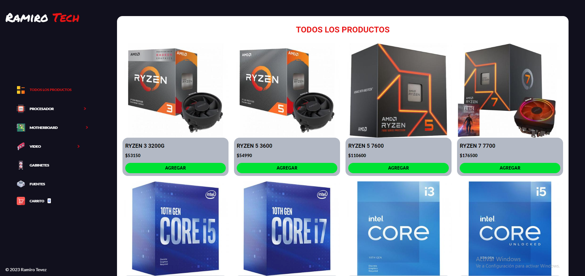
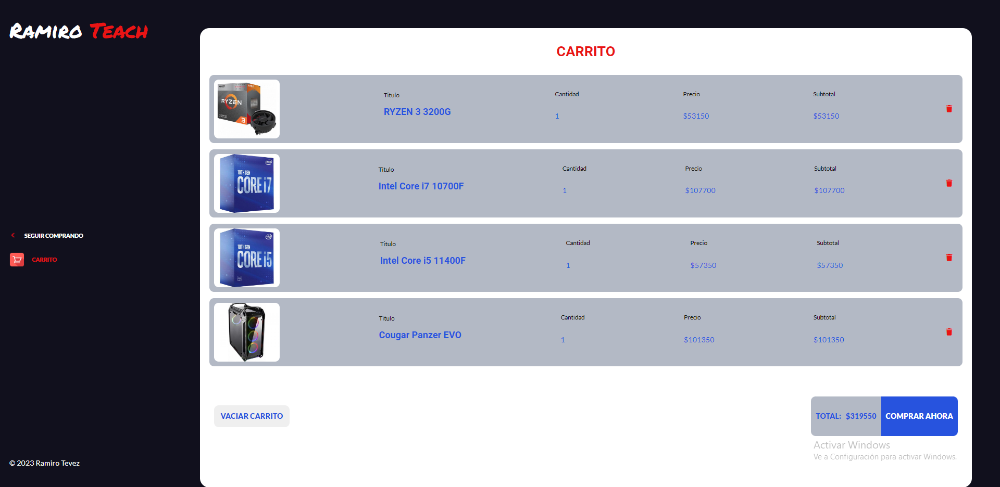
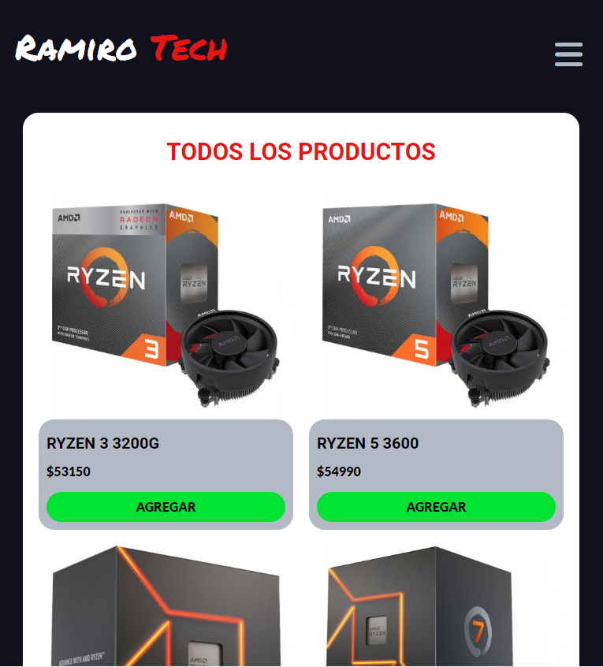
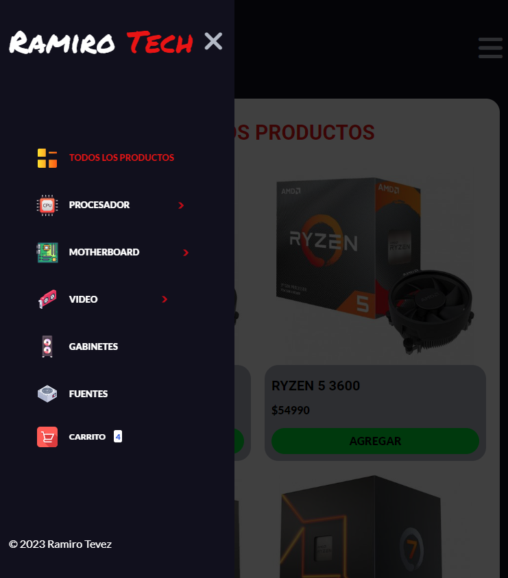

# Proyecto Final del curos de Javascript de Coderhouse!

* E-commerce Basico empleado lo visto en el curso de Js, con localstorage, fetch, librerias etc

# Un e-commerce bastante simple
* Con un carrito de compras y algunos sweet alerts

# Tambien es responsive 
* Se adapta a tablet y celulares

# Con boton hamburguesa 

# Link del proyecto
https://ramirotech-ecommerce.netlify.app/

